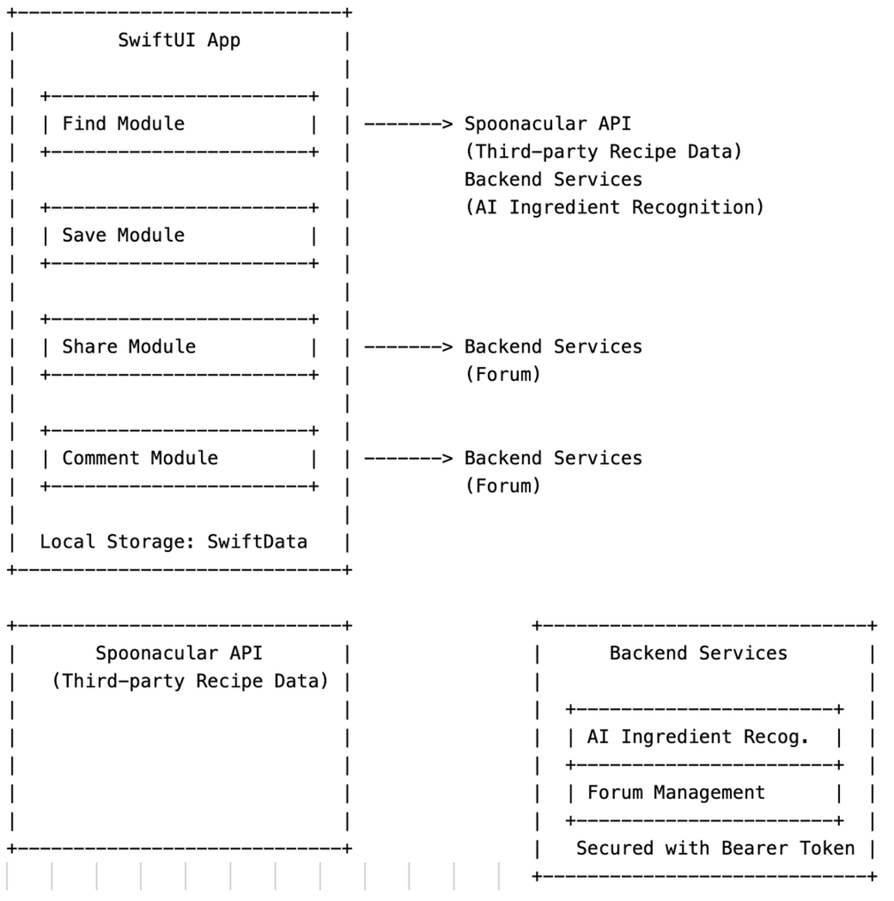
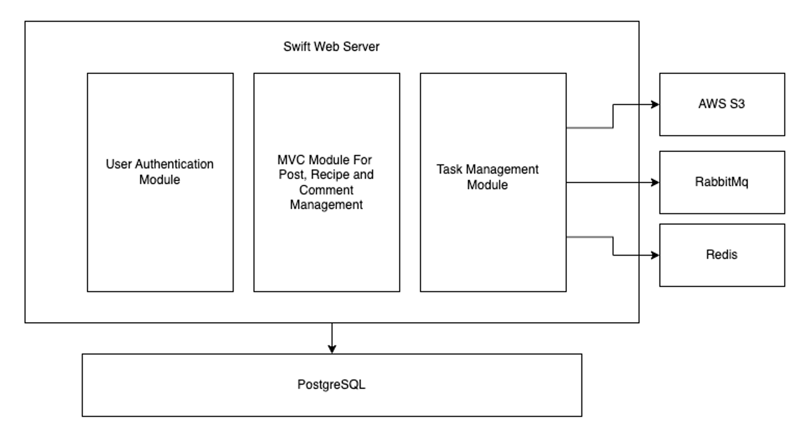
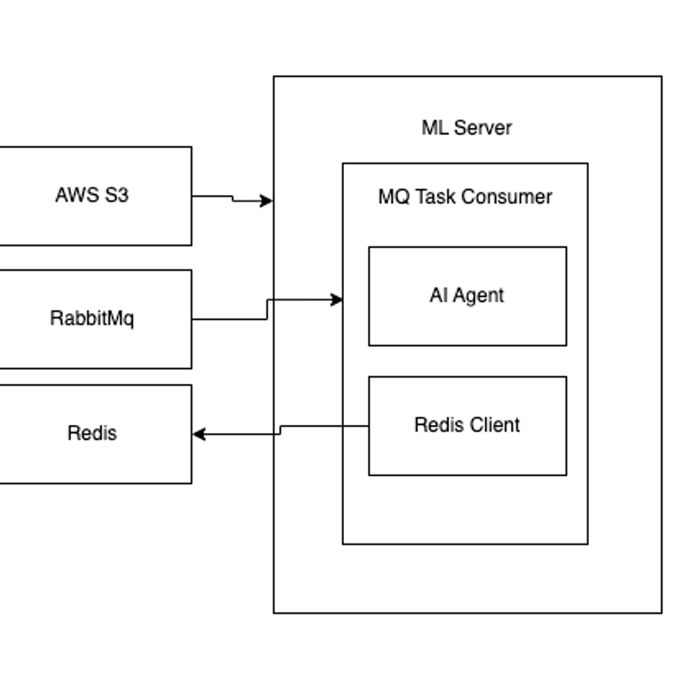

# Table of Contents

- [Table of Contents](#table-of-contents)
- [MealFinderApp Guide](#mealfinderapp-guide)
  - [Important Clarifications for Code Review](#important-clarifications-for-code-review)
  - [**Accounts for Code Review**](#accounts-for-code-review)
  - [App Setup](#app-setup)
  - [App Structure](#app-structure)
  - [App features (User Guide for MealFinderApp)](#app-features-user-guide-for-mealfinderapp)
    - [Login and Register](#login-and-register)
    - [Find Page](#find-page)
      - [Result Pop-up](#result-pop-up)
      - [Recipe Details](#recipe-details)
    - [Library Page](#library-page)
    - [Forum Page](#forum-page)
      - [Post Details](#post-details)
    - [Log out page](#log-out-page)
- [MealFinderServer Guide](#mealfinderserver-guide)
  - [Server Setup](#server-setup)
  - [Migrations](#migrations)
  - [Swift Web Server Structure](#swift-web-server-structure)
  - [Design of Image Recognition Service](#design-of-image-recognition-service)
    - [Image Recognition Server Design](#image-recognition-server-design)
  - [API Endpoints](#api-endpoints)
    - [Authentication and User Management](#authentication-and-user-management)
      - [POST /users](#post-users)
      - [GET /users/:id](#get-usersid)
      - [POST /users/login](#post-userslogin)
      - [POST /users/logout](#post-userslogout)
      - [GET /users/me](#get-usersme)
      - [PUT /users/:id](#put-usersid)
      - [DELETE /users/:id](#delete-usersid)
    - [Post Management](#post-management)
      - [POST /posts](#post-posts)
      - [GET /posts/:id](#get-postsid)
      - [GET /posts/:id/comments](#get-postsidcomments)
      - [POST /posts/create](#post-postscreate)
      - [POST /posts/:id/like](#post-postsidlike)
      - [POST /posts/:id/dislike](#post-postsiddislike)
      - [POST /posts/:id/comments](#post-postsidcomments)
      - [PUT /posts/:id](#put-postsid)
      - [DELETE /posts/:id](#delete-postsid)
    - [Comment Management](#comment-management)
      - [GET /comments/:id](#get-commentsid)
      - [POST /comments/:id](#post-commentsid)
      - [POST /comments/:id/like](#post-commentsidlike)
      - [POST /comments/:id/dislike](#post-commentsiddislike)
      - [DELETE /comments/:id](#delete-commentsid)
    - [Task Registration](#task-registration)
      - [POST /tasks](#post-tasks)
      - [GET /tasks/:id](#get-tasksid)


# MealFinderApp Guide

## Important Clarifications for Code Review

*Clarification for User Authentication System:* The user register and login system is implemented for server safety and security. We want to make sure that only authorized users can access certain services. We believe that's common practice in real-world applications.

*API Usage Clarification:* Because we are using the free version of Spoonacular API (a third-party API for recipe search), the API has a **limit on the number of requests** on a **daily** basis. If you encounter any usage issues, usually `Failed to fetch instructions for recipe`, please inform us or replace the api key in the `utils/RecipeService.swift` file.

*Server Availability Clarification:* Although we have designed the server in a proper way and used several methods to ensure the server is available in most cases, there might be possibility that the server is not available due to vcm issues or other reasons. If you encounter any server issues, please inform us and we will try to fix it as soon as possible.

## **Accounts for Code Review**

Accounts:
- Username: `Carl`, Password: `111`
- Username: `Kejia`, Password: `222`
- Username: `Ric`, Password: `000`

## App Setup

clone the repo and run the app on Xcode.


## App Structure



## App features (User Guide for MealFinderApp)

### Login and Register

Use preregistred accounts to login or register a new account in the initial screen.

### Find Page

- Search Bar: Search for recipes by ingredients.
- Search By Image: Take a photo or upload an image to search for recipes.

#### Result Pop-up

- After searching, results will be displayed in a pop-up window.
- Swipe left or right to view different recipes and click on the recipe to view details.

#### Recipe Details
- Click `Save` to save the recipe to your **local** favorite library.
- Click `Share` Button to share the recipe on the forum as a post.

### Library Page

- Click list items to view recipes saved in the library.
- Swipe left to delete a recipe from the library.
- Detail page also has the `Share` button to share the recipe on the forum as a post. 

### Forum Page

- View posts from other users.
- Click on a post to view details.

#### Post Details

- Click `Like` or `Dislike` to like or dislike **a post or a comment**.
- Click `Add Comment` to add a comment to the post.
- Click `Reply` to reply to a comment. 
- Click `Delete` to delete a post or a comment (**only the author can delete**).

### Log out page

- Click `Log out` to log out of the app.

# MealFinderServer Guide

## Server Setup

A running instance contains all services is deployed on Duke VCM. For code review use, you can use mobile app to interact with the server directly.

To deploy the server on you own server or local machine, follow the steps below:

1. Prerequisites: (ensure you have these services running and add `.env` file in the root directory)
  - RabbitMQ
  - Redis
  - S3 Bucket
  - PostgreSQL

2. Set up Swift Web Server
  - clone the server repo
  - Install Swift (version 6.0)
  - run `Swift run build` to build the project
  - run `Swift run App` to start the server

3. Set up ML Server
   - clone the server repo
   - Setup and Install Poetry for Python 3.13
   - run `poetry install` to install dependencies
   - run `python main.py` to start the server
 
## Migrations

  ```Shell

  vapor run migrate

  vapor run migrate --revert

  vapor run migrate --revert-all

  ```

## Swift Web Server Structure



## Design of Image Recognition Service


  - Microservice: Decoupled RESTful API service with Machine Learning model for image recognition
  - 3 phase:
    - Task registration (By Swift Web Server): save image to S3 bucket and register task to RabbitMQ
    - Task processing (By Machine Learning Model Server): consume task from RabbitMQ, download image from S3 bucket, process image with ML model, save result to Redis
    - Task result query (By Swift Web Server): query result from Redis by task id
  - Technologies:
    - Swift Web Server: Vapor
    - Machine Learning Model Server: Python Flask with PyTorch
    - Message Queue: RabbitMQ
    - Image Storage: S3
    - Cache: Redis
  - Basic Structure:
   

  ### Image Recognition Server Design

    

  For better scalability and flexibility, the ML consumer server is designed to be a separate service from the main web server. 
  - Written in Python
  - Pika for RabbitMQ
  - Poetry for dependency management
  - Designed AI agents based on OpenAI GPT-4o-mini as Image Recognition Model

  To run the ML server, ensure you have Python 3.13 installed and use `poetry install` to install dependencies. 

## API Endpoints

### Authentication and User Management

#### POST /users

- Create a new user
- Request Body: 
  ```json
  {
    "username": "username",
    "email": "email",
    "password": "password"
  }
  ``` 

- Response Body:
  ```json
  {
    "id": "id",
    "username": "username",
    "email": "email"
  }
  ```  
#### GET /users/:id

- Get user info by id
- Response Body:
  ```json
  {
    "id": "id",
    "username": "username",
    "email": "email"
  }
  ```  

#### POST /users/login

- Login user to get token
- Request Body:
  ```json
  {
    "username": "username",
    "password": "password"
  }
  ```
- Response Body:
  ```json
  {
    "token": "token"
  }
  ```

#### POST /users/logout

- Logout user
- token required

#### GET /users/me

- Get detailed user info
- token required
- Response Body:
  ```json
  {
    "id": "id",
    "username": "username",
    "email": "email"
  }
  ```

#### PUT /users/:id

- Update user info
- token required
- won't invalidate token
- Request Body:
  ```json
  {
    "username": "username",
    "email": "email",
    "password": "password"
  }
  ```
- Response Body:
  ```json
  {
    "id": "id",
    "username": "username",
    "email": "email"
  }
  ```

#### DELETE /users/:id

- Delete user
- token required


### Post Management

#### POST /posts

- set posts by certain order in certain quantity

- Request Body:
  ```swift
  struct IndexByOrderWithQuantityRequest: Content {
    var order: PostOrder?
    var index: Int?
    var offset: Int?
    var direction: PostDirection?
  }

  enum PostOrder: String, Content {
    case createdAt = "created_at"
    case updatedAt = "updated_at"
    case likes = "likes"
    // case dislikes = "dislikes"
  }

  enum PostDirection: String, Content {
      case asc = "asc"
      case desc = "desc"
  }
  ```

#### GET /posts/:id

- Get post by id

#### GET /posts/:id/comments

- Get direct comments of post by id

#### POST /posts/create

- Create a new post
- token required

- Request Body:
  ```swift
  struct CreatePostRequest: Content {
      var title: String
      var content: String
      var recipe: CreateRecipeRequest
  }

  struct CreateRecipeRequest: Content {
      var title: String
      var content: String
      var ingredients: [String]
      var image: String // url
  }
  ```

#### POST /posts/:id/like

- Like a post
- token required

#### POST /posts/:id/dislike

- Dislike a post
- token required

#### POST /posts/:id/comments

- Create a new comment on post
- token required
- Request Body:
  ```swift
  struct CreateCommentRequest: Content {
    var title: String
    var content: String
  }
  ```

#### PUT /posts/:id

- Update post
- token required
- Request Body:
  ```swift
  struct UpdatePostRequest: Content {
    var title: String?
    var content: String?   
  }
  ```

#### DELETE /posts/:id

- Delete post
- token required

### Comment Management

#### GET /comments/:id

- fetch all child comments of certain comment

#### POST /comments/:id

- create a new comment on certain comment
- token required
- Request Body:
  ```swift
  struct CreateCommentRequest: Content {
    var title: String
    var content: String
  }
  ```

#### POST /comments/:id/like

- Like a comment
- token required

#### POST /comments/:id/dislike

- Dislike a comment
- token required

#### DELETE /comments/:id 

- Delete comment
- token required

### Task Registration

#### POST /tasks

- Register a new task with an image
- ***token required***
- **Compress image before sending**
- Request Body:
  ```swift
  struct CreateTaskRequest: Content {
      var image: File
  }
  ```
- Response Body:
  ```swift
  struct TaskDTO: Content {
    var taskID: UUID
    var key: String
    var url: String 
  }
  ```

#### GET /tasks/:id

- Get task info by id
- token required
- Request Body: 
  ```swift
  struct CheckTaskResponse: Content {
    var taskID: UUID
    var status: TaskStatus
    var result: [String]? // the result of the task
  }
  ```
- Response Sample:
  ```json
  {
    "taskID": "9F28A645-07E8-43F3-B646-AF766C88017D",
    "result": [
        "flour, eggs, milk, butter, white sugar, brown sugar, baking powder, salt"
    ],
    "status": "completed"
  }
  ```
  ```json
  {
      "taskID": "3B3A71BA-EAF5-4D6A-A574-E3E68DFFCC5B",
      "result": [
          "cauliflower, carrots, broccoli, lettuce, garlic, yellow bell pepper, tomatoes, green bell pepper, zucchini, red bell pepper, celery, green onions, white radishes, parsley, green beans"
      ],
      "status": "completed"
  }
  ```


