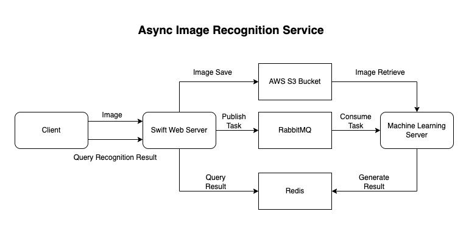

# MealFinderServer README

## Migrations

  ```Shell

  vapor run migrate --revert

  vapor run migrate --revert-all

  ```

  ```Shell
  vapor run migrate --revert-all
  vapor run migrate
  ```


## Design of Image Recognition Service


  - Microservice: Decoupled RESTful API service with Machine Learning model for image recognition
  - 3 phase:
    - Task registration (By Swift Web Server): save image to S3 bucket and register task to RabbitMQ
    - Task processing (By Machine Learning Model Server): consume task from RabbitMQ, download image from S3 bucket, process image with ML model, save result to Redis
    - Task result query (By Swift Web Server): query result from Redis by task id
  - Technologies:
    - Swift Web Server: Vapor
    - Machine Learning Model Server: Python Flask with PyTorch ? (not implemented)
    - Message Queue: RabbitMQ
    - Image Storage: S3
    - Cache: Redis
  - Basic Structure:
   

## API Endpoints

### Authentication and User Management

#### POST /users

- Create a new user
- Request Body: 
  ```json
  {
    "username": "username",
    "email": "email",
    "password": "password"
  }
  ``` 

- Response Body:
  ```json
  {
    "id": "id",
    "username": "username",
    "email": "email"
  }
  ```  
#### GET /users/:id

- Get user info by id
- Response Body:
  ```json
  {
    "id": "id",
    "username": "username",
    "email": "email"
  }
  ```  

#### POST /users/login

- Login user to get token
- Request Body:
  ```json
  {
    "username": "username",
    "password": "password"
  }
  ```
- Response Body:
  ```json
  {
    "token": "token"
  }
  ```

#### POST /users/logout

- Logout user
- token required

#### GET /users/me

- Get detailed user info
- token required
- Response Body:
  ```json
  {
    "id": "id",
    "username": "username",
    "email": "email"
  }
  ```

#### PUT /users/:id

- Update user info
- token required
- won't invalidate token
- Request Body:
  ```json
  {
    "username": "username",
    "email": "email",
    "password": "password"
  }
  ```
- Response Body:
  ```json
  {
    "id": "id",
    "username": "username",
    "email": "email"
  }
  ```

#### DELETE /users/:id

- Delete user
- token required


### Post Management

#### POST /posts

- set posts by certain order in certain quantity

- Request Body:
  ```swift
  struct IndexByOrderWithQuantityRequest: Content {
    var order: PostOrder?
    var index: Int?
    var offset: Int?
    var direction: PostDirection?
  }

  enum PostOrder: String, Content {
    case createdAt = "created_at"
    case updatedAt = "updated_at"
    case likes = "likes"
    // case dislikes = "dislikes"
  }

  enum PostDirection: String, Content {
      case asc = "asc"
      case desc = "desc"
  }
  ```

#### GET /posts/:id

- Get post by id

#### GET /posts/:id/comments

- Get direct comments of post by id

#### POST /posts/create

- Create a new post
- token required

- Request Body:
  ```swift
  struct CreatePostRequest: Content {
      var title: String
      var content: String
      var recipe: CreateRecipeRequest
  }

  struct CreateRecipeRequest: Content {
      var title: String
      var content: String
      var ingredients: [String]
  }
  ```

#### POST /posts/:id/like

- Like a post
- token required

#### POST /posts/:id/dislike

- Dislike a post
- token required

#### POST /posts/:id/comments

- Create a new comment on post
- token required
- Request Body:
  ```swift
  struct CreateCommentRequest: Content {
    var title: String
    var content: String
  }
  ```

#### PUT /posts/:id

- Update post
- token required
- Request Body:
  ```swift
  struct UpdatePostRequest: Content {
    var title: String?
    var content: String?   
  }
  ```

#### DELETE /posts/:id

- Delete post
- token required

### Comment Management

#### GET /comments/:id

- fetch all child comments of certain comment

#### POST /comments/:id

- create a new comment on certain comment
- token required
- Request Body:
  ```swift
  struct CreateCommentRequest: Content {
    var title: String
    var content: String
  }
  ```

#### POST /comments/:id/like

- Like a comment
- token required

#### POST /comments/:id/dislike

- Dislike a comment
- token required

#### DELETE /comments/:id 

- Delete comment
- token required

### Task Registration

#### POST /tasks

- Register a new task with an image
- token required
- Request Body:
  ```swift
  struct CreateTaskRequest: Content {
      var image: File
  }
  ```
- Response Body:
  ```swift
  struct TaskDTO: Content {
    var taskID: UUID
    var key: UUID
    var url: String 
  }
  ```

#### GET /tasks/:id

- Get task info by id
- token required
- Request Body: 
  ```swift
  struct CheckTaskResponse: Content {
    var taskID: UUID
    var status: TaskStatus
    var result: [String]? // the result of the task
  }
  ```


